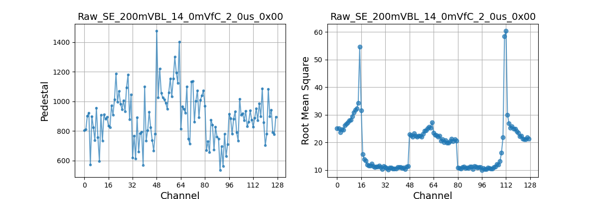
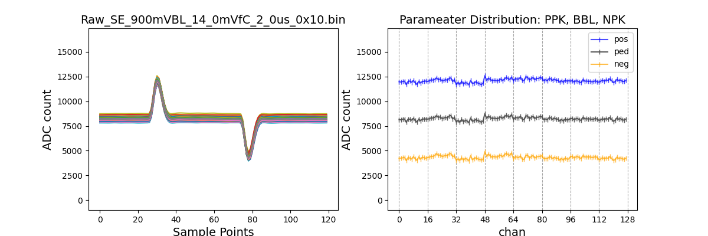
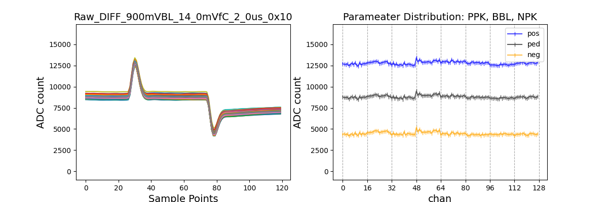

# femb id 53	      faild	 the assembly checkout

### PART 01 INPUT INFORMATION    < Pass >

|Operator|env|Toy_TPC|Note|FEMB ID|date|
|---|---|---|---|---|---|
|lke|LN|150 pF|LNCK|{'femb3': 'E53'}|06_23_2021_06_37_41|

### Configuration:	       14 mV/fC;   2 us;  200 mV; SE, DIFF;

### Here is the issue: 
{'PED 128-CH std': 894.3783482142858, 'RMS 128-CH std': 20.236796337682993, 'baseline err_status': [[48, 63], [3, 3]], 'RMS err_status': [[7, 8, 9, 10, 11, 12, 13, 14, 15, 16, 20, 21, 22, 23, 24, 25, 26, 27, 28, 29, 30, 31, 32, 33, 34, 35, 36, 37, 38, 39, 40, 41, 42, 43, 44, 45, 46, 47, 63, 80, 81, 82, 83, 84, 85, 86, 87, 88, 89, 90, 91, 92, 93, 94, 95, 96, 97, 98, 99, 100, 101, 102, 103, 104, 105, 106, 107, 108, 111, 112, 113], [0, 0, 0, 0, 0, 0, 0, 0, 0, 1, 1, 1, 1, 1, 1, 1, 1, 1, 1, 1, 1, 1, 2, 2, 2, 2, 2, 2, 2, 2, 2, 2, 2, 2, 2, 2, 2, 2, 3, 5, 5, 5, 5, 5, 5, 5, 5, 5, 5, 5, 5, 5, 5, 5, 5, 6, 6, 6, 6, 6, 6, 6, 6, 6, 6, 6, 6, 6, 6, 7, 7]], 'Result': False} 
{'Result': False, 'Issue List': ['LDO Monitor CDVDDA = 179, issue', 'LDO Monitor CDVDDIO = 358, issue', 'LDO Monitor ADCRVDDD1P2 = 179, issue', 'LDO Monitor ADCLVDDD1P2 = 179, issue', 'LDO Monitor FERVDDP = 178, issue', 'LDO Monitor FELVDDP = 179, issue', 'LDO Monitor ADCRP25V = 357, issue', 'LDO Monitor ADCLP25V = 355, issue']} 
{'Result': False, 'Issue List': ['LDO Monitor CDVDDA = 175, issue', 'LDO Monitor CDVDDIO = 348, issue', 'LDO Monitor ADCRVDDD1P2 = 174, issue', 'LDO Monitor ADCLVDDD1P2 = 174, issue', 'LDO Monitor FERVDDP = 175, issue', 'LDO Monitor FELVDDP = 174, issue', 'LDO Monitor ADCRP25V = 349, issue', 'LDO Monitor ADCLP25V = 351, issue']} 

------
### PART 02 Initial Test    < Pass >

#### 2.1 Initial Current Measurement
| Initial Current Measurement |  | | |  |
| --- | --- | --- | --- | --- |
| Measure Object | BIAS | LArASIC | ColdDATA | ColdADC |
| V_set/V |  5 | 3 | 3 | 3.5  |
| V_meas/V | 5.0 | 3.021 | 3.081 | 3.533 |
| I_meas/V | 0.0 | 0.421 | 0.168 | 1.74 |
| P_meas/V | 0.0 | 1.272 | 0.518 | 6.147 |
| Total Power |  7.94 |  | |  |

#### 2.2 Check FEMB Registers
|COLDATA_REG_1|ColdADC_REG_1|COLDATA_REG_2|Result|ColdADC_REG_2|
|---|---|---|---|---|
|Pass|Pass|Pass|True|Pass|

### PART 03 SE Interface Measurement | Fail

#### 3.1 No Buffer RMS at 200mV, 14mV/fC, 2us, DAC = 0x00

| SE Noise Measurement | VALUE |
| --- | --- |
| PED 128-CH std | 894.3783482142858 |
| RMS 128-CH std | 20.236796337682993 |
| baseline err_status | [[48, 63], [3, 3]] |
| RMS err_status | [[7, 8, 9, 10, 11, 12, 13, 14, 15, 16, 20, 21, 22, 23, 24, 25, 26, 27, 28, 29, 30, 31, 32, 33, 34, 35, 36, 37, 38, 39, 40, 41, 42, 43, 44, 45, 46, 47, 63, 80, 81, 82, 83, 84, 85, 86, 87, 88, 89, 90, 91, 92, 93, 94, 95, 96, 97, 98, 99, 100, 101, 102, 103, 104, 105, 106, 107, 108, 111, 112, 113], [0, 0, 0, 0, 0, 0, 0, 0, 0, 1, 1, 1, 1, 1, 1, 1, 1, 1, 1, 1, 1, 1, 2, 2, 2, 2, 2, 2, 2, 2, 2, 2, 2, 2, 2, 2, 2, 2, 3, 5, 5, 5, 5, 5, 5, 5, 5, 5, 5, 5, 5, 5, 5, 5, 5, 6, 6, 6, 6, 6, 6, 6, 6, 6, 6, 6, 6, 6, 6, 7, 7]] |
| Result | False |

#### 3.2 No Buffer interface Current Measurement
| SE Current Measurement |  | | |  |
| --- | --- | --- | --- | --- |
| Measure Object | BIAS | LArASIC | ColdDATA | ColdADC |
| V_set/V |  5 | 3 | 3 | 3.5  |
| V_meas/V | 5.0 | 3.023 | 3.068 | 3.532 |
| I_meas/V | 0.0 | 0.409 | 0.226 | 1.709 |
| P_meas/V | 0.0 | 1.236 | 0.693 | 6.036 |
| Total Power |  7.96 |  | |  |

#### 3.3 No Buffer Interface power rail
|CDVDDA|CDVDDIO|ADCRVDDD1P2|ADCLVDDD1P2|FERVDDP|FELVDDP|ADCRP25V|ADCLP25V|GND|
|---|---|---|---|---|---|---|---|---|
| 179 | 358 | 179 | 179 | 178 | 179 | 357 | 355 |215|

#### 3.4 No Buffer Interface Pulse at 900mV 14mV/fC 2us

| SE Pulse Response | VALUE |
| --- | --- |
| Result | True |

### PART 04 DIFF Interface Measurement | Fail

## 4.1 SEDC Pulse Measurement at 900mV, 14mV/fC, 2us

| 4.1 DIFF Pulse Measurement | VALUE |
| --- | --- |
| Result | True |

## 4.2 SEDC interface Current Measurement
| 4.2 DIFF Current Measurement |  | | |  |
| --- | --- | --- | --- | --- |
| Measure Object | BIAS | LArASIC | ColdDATA | ColdADC |
| V_set/V |  5 | 3 | 3 | 3.5  |
| V_meas/V | 5.0 | 2.945 | 3.066 | 3.53 |
| I_meas/V | 0.0 | 0.748 | 0.226 | 1.74 |
| P_meas/V | 0.0 | 2.203 | 0.693 | 6.142 |
| Total Power |  9.04 |  | |  |

## 4.3 DIFF Power Rail
|CDVDDA|CDVDDIO|ADCRVDDD1P2|ADCLVDDD1P2|FERVDDP|FELVDDP|ADCRP25V|ADCLP25V|GND|
|---|---|---|---|---|---|---|---|---|
| 175 | 348 | 174 | 174 | 175 | 174 | 349 | 351 |215|

## PART 05 Monitoring Path Measurement    < Pass >

## 5 Monitoring Path
| Monitor Path |  | | | | | | | |
| --- | --- | --- | --- | --- | --- | --- | --- | --- |
| ASIC # |  0 | 1 | 2 | 3 | 4 | 5 | 6 | 7  |
| FE T |  260.6 | 256.6 | 232.8 | 250.1 | 249.1 | 253.1 | 257.5 | 238.2  |
| FE BGP |  1151.0 | 1152.1 | 1141.5 | 1149.0 | 1146.5 | 1149.8 | 1153.6 | 1145.8  |
| ADC_VCMI |  903.5 | 897.4 | 899.5 | 896.3 | 893.0 | 893.0 | 894.0 | 893.0  |
| ADC_VCMO |  1201.4 | 1197.9 | 1199.0 | 1197.2 | 1192.6 | 1194.5 | 1190.2 | 1191.3  |
| ADC_VREFP |  1950.8 | 1951.2 | 1947.8 | 1945.9 | 1938.6 | 1944.2 | 1941.0 | 1942.4  |
| ADC_VREFN |  445.7 | 445.6 | 444.9 | 444.1 | 445.1 | 442.2 | 438.2 | 441.1  |
| VSSA |  32.2 | 34.0 | 34.2 | 34.2 | 34.8 | 33.5 | 37.0 | 34.2  |

